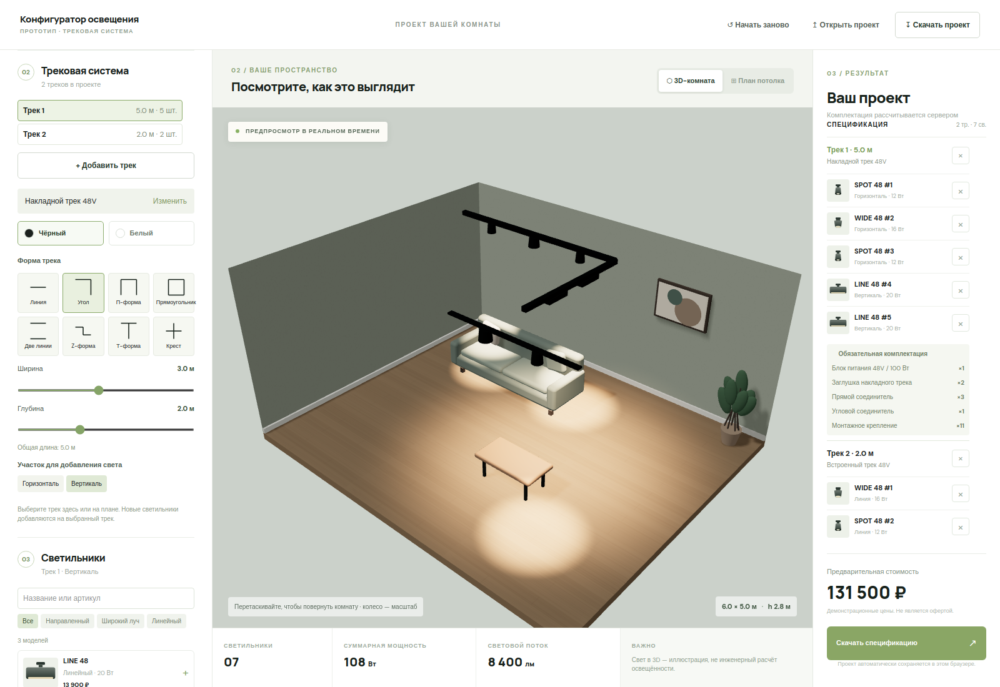
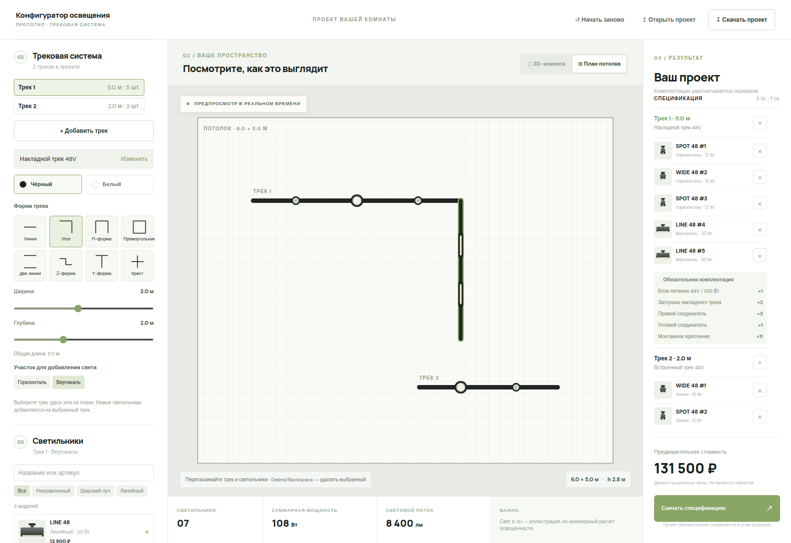

# Конфигуратор трекового освещения

[Live demo on GitHub Pages](https://thesmol.github.io/lights-configurator/)

Десктопный прототип на React, TypeScript, Tailwind CSS и Three.js с REST API на Node.js. Поддерживает несколько независимых треков, восемь параметрических форм, размещение светильников по участкам, 2D-план и 3D-комнату. Обязательная комплектация рассчитывается по геометрии, типу профиля и нагрузке. Каталог имеет поиск, фильтры и страницы; новые модели используют данные товаров, а не фиксированные ID в интерфейсе.

Каталог, цены и монтажные нормы демонстрационные. Свет в 3D иллюстративный. Проект автоматически сохраняется в браузере, экспортируется в JSON и открывает старый однотрековый формат.

## Десктопное превью

### 3D-комната



### План потолка



## Быстрый старт

```bash
npm ci
npm run dev
```

Приложение: `http://localhost:5173` (или порт из вывода Vite). API: `http://localhost:8787`.

```bash
npm run format:check
npm test
npm run build
npm start
```

Готовый сервер раздаёт API и приложение на порту 8787. Для browser-проверки запущенного приложения: `TEST_URL=http://localhost:8787 npm run check:ui`.

## Документация

- [Архитектура, модель проекта и расширение каталога](docs/architecture.md)
- [REST API и примеры запросов](docs/api.md)
- [Правила обязательной комплектации](docs/specification-rules.md)
- [Запуск, проверки и публикация](docs/development.md)
- [Будущие доработки, включая свободную сборку треков](docs/roadmap.md)

## Публикация

Push в `main` запускает workflow GitHub Pages. В настройках репозитория источник Pages должен быть **GitHub Actions**. Статическая демоверсия использует тот же каталог и расчёт локально; обычный запуск получает данные и цену через REST. Динамический production API потребует отдельного хостинга.
